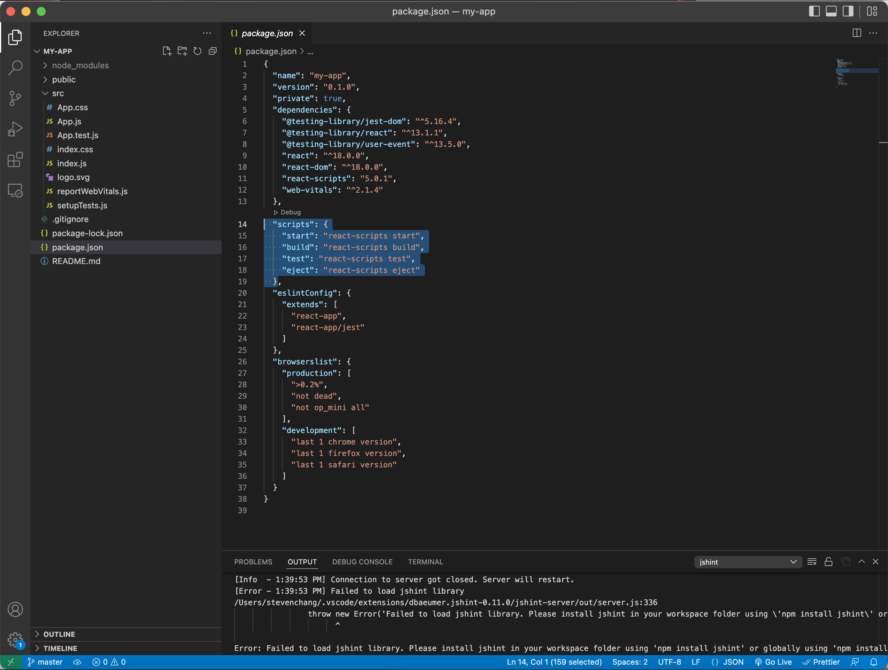
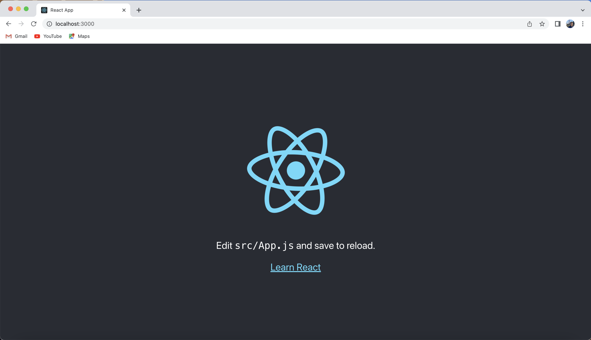
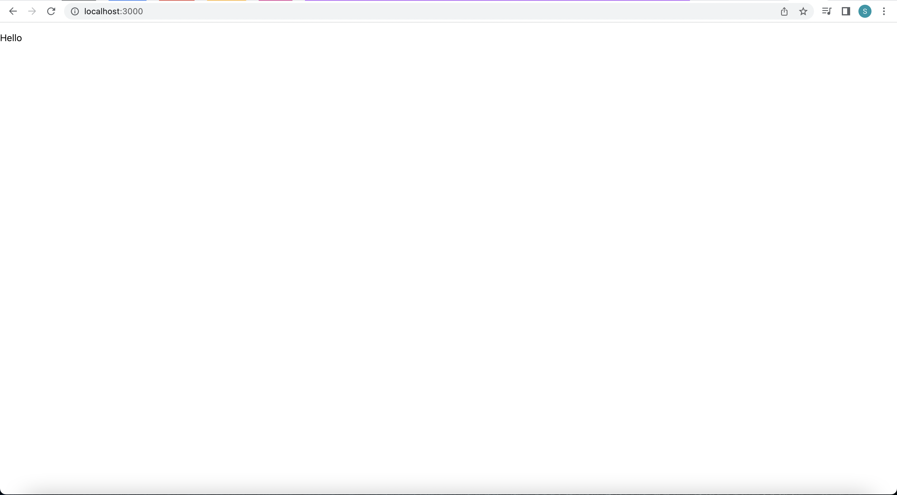
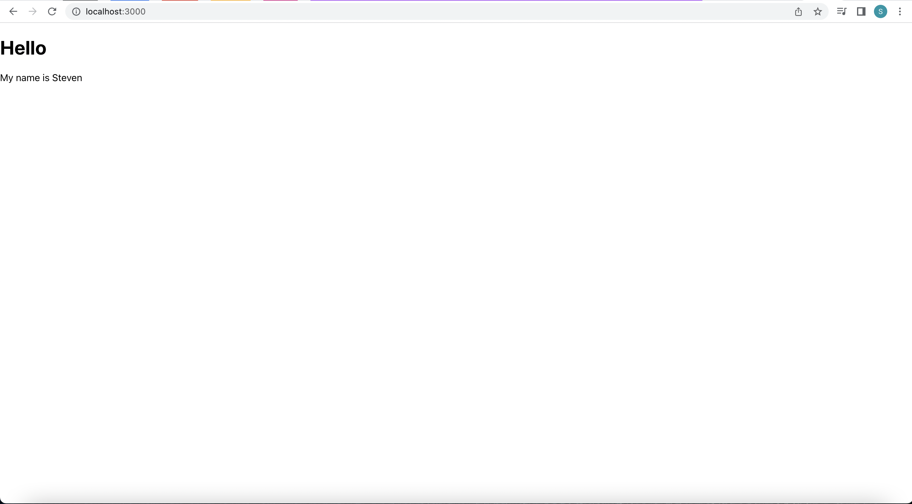
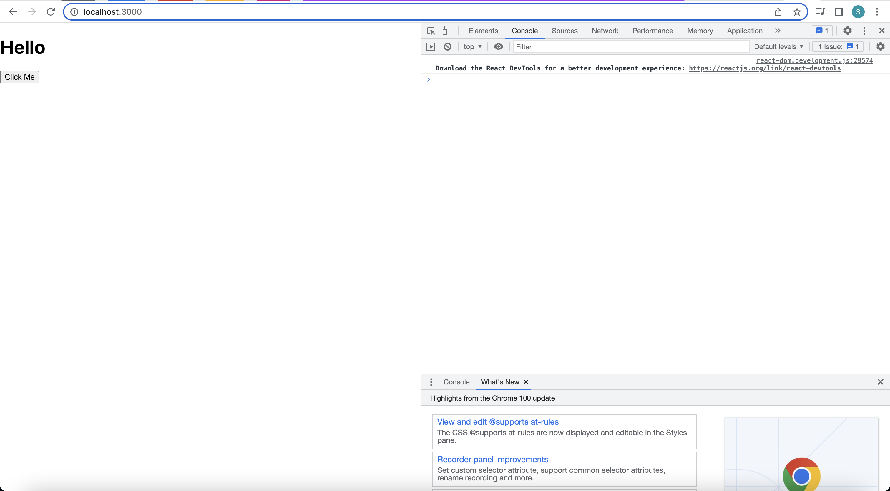

# Reactjs

[Official Doc](https://reactjs.org/)

## Table of Content
### 1. [Intro](#intro)
### 2. [Set up](#set-up)
### 3. [Layout](#layout)
### 4. [JSX](#jsx)
### 5. [Components](#components)
* [Functional and Class Component](#functional-and-class-component)
* [Props](#props)
  * [Parent to Child](#parent-to-child)
  * [Child to Parent](#child-to-parent)
* [Event](#event)
* [Lifecycle](#lifecycle)
* [Hooks](#hooks)
  * [State](#state)
  * [Effect](#effect)
### 6. [Styling](#styling)
### 7. [Webpack](#webpack)

## Intro

React is a front-end JavaScript library for building user interfaces, and currently it's one of the most popular frameworks in the communities, others are Vuejs, Angular and svelte etc.

The main characteristic of React is it encourage developers to write pure functional code and make use of the concept of functional programming, and it also supports mobile app development (React Native) which you can learn more in [this doc](https://reactnative.dev/), but in this program, we will be focusing on React

## Set up

To create an react project, after installing nodejs and npm, simply run:
```
npx create-react-app my-app
```
This will create a react project called ```my-app```

On VS code, you will see the following file system


Don't get scared away, the important file that you need to focusing on is ```package.json``` and ```src``` folder.

```src``` folder is the source folder, most of your code will be written here, the code starts from ```index.js``` with the root components as ```App.js``` and then your code will be expand from here. For more information, you will learn in the [Components](components) section

```package.json``` contains the project information such as all the installed libraries information and scripts that you can run, for example to start the local host server, you can run ```npm run start``` in the terminal.

After running ```npm run start```, you should see the following

And it is running on ```http://localhost:3000``` which is our local host server

## Layout

Now we will look closely into ```index.js``` and ```App.js```. ```index.js``` is shown as follow:
```
//index.js
import React from 'react';
import ReactDOM from 'react-dom/client';
import './index.css';
import App from './App';
import reportWebVitals from './reportWebVitals';

const root = ReactDOM.createRoot(document.getElementById('root'));
root.render(
  <React.StrictMode>
    <App />
  </React.StrictMode>
);

reportWebVitals();
```

Notice the ```root``` object, we can see there is a DOM operation as an argument being passed into ```ReactDOM.createRoot()``` function. To understand this, let's take a look of the ```index.html``` file in the ```public``` folder:

```
<!DOCTYPE html>
<html lang="en">
  <head>
    <meta charset="utf-8" />
    <link rel="icon" href="%PUBLIC_URL%/favicon.ico" />
    <meta name="viewport" content="width=device-width, initial-scale=1" />
    <meta name="theme-color" content="#000000" />
    <meta
      name="description"
      content="Web site created using create-react-app"
    />
    <link rel="apple-touch-icon" href="%PUBLIC_URL%/logo192.png" />
    <link rel="manifest" href="%PUBLIC_URL%/manifest.json" />
    <title>React App</title>
  </head>
  <body>
    <noscript>You need to enable JavaScript to run this app.</noscript>
    <div id="root"></div>
  </body>
</html>

```

Notice in the ```body``` there's a ```<div></div>``` with ```id="root"```. Therefore, ```ReactDOM.createRoot(document.getElementById('root'));``` basically means whatever the contents we wrote in ```root```, it will be injected into the empty ```<div>``` tag. In this case is the content inside ```App.js```, and if we change the content in ```App.js``` as
```
//App.js
const App = () => {
  return (
    <div className="App">
      <p>Hello</p>
    </div>
  );
}

export default App;
```
You will see the following


This is basically how React works

## JSX
Taking the ```App.js``` code above as an example, JSX is a html-like syntax that is being used in React, they have some syntax difference. For example ```class``` attribute in HTML becomes ```className``` in JSX, and JSX also combines the functionality of eventlistener for example JSX has ```onClick``` attribute which is basically ```addEventListener('click',()=>{})```. We will be using JSX extensively when writing React.

Another important difference is JSX allows ***Embedding Expressions*** in React. For example ```App.js``` can be written equivalently as follows
```
//App.js
const App = () => {
  const text = "Hello"

  return (
    <div className="App">
      <p>{text}</p>
    </div>
  );
}

export default App;
```
The result will still be

You can put any valid JavaScript expression inside the ```{}``` expression such as ```{2+3}```, ```{person.firstname}```. It will get executed based on the JavaScript rule


## Components
```App.js``` itself is a component in React, and when importing ```App``` component into other file or component, it will becomes a tag like normal HTML tag.

For example when importing ```App``` component into ```index.js```, you can see they use the syntax ```<App />``` it is called self closing tag. By coding convention, the component name should be capitalized such as ```App.js```

***Note, as the name suggests, when you are writing the components, it can only take one component inside ```return``` function, therefore you need to wrap everything inside the ```div``` tag as I have shown in the ```App.js``` example***

### Functional and Class Component

There are two ways of writing the components: ***Functional Component and Class Component***

```
// Functional Component
import React, { useState } from "react";
  
const Counter = (props) =>{
    const [count, setCount] = useState(0); // Will cover it in Hooks
  
    const increase = () => {
        setCount(count+1);
    }
  
    return (
        <div>
            <h1>{props.headline}</h1> // Will cover it in Props
          <h2>{count}</h2>
            <button onClick={increase}>Add</button> // Will cover it in Events
        </div>
    )
}  
  
  
export default Counter;

```

```
// Class Component
import React, { Component } from "react";
  
class Counter extends React.Component{
    constructor(){
        super();
        this.state={
            count :0
        };
        this.increase=this.increase.bind(this);
    }
      
   increase(){
       this.setState({count : this.state.count +1});
   }
  
    render(){
        return (
            <div>
               <h1>{this.props.headline}</h1>
               <h2> {this.state.count}</h2>  
               <button onClick={this.increase}>Add</button>
  
            </div>
        )
    }
}
  
export default Counter;
```

***Class Component*** is more OOP style while ***Functional Component*** is more FP style. According to the React official doc, developers are encouraged to use ***Functional Component***, so for the later section, we will use ***Functional Component*** when showing the code example.

### Props
When dealing with different components, if becomes a problem how to communicate or tansfer data between each components, now that's when Props comes into play. There are two main types of data transfer: ***Parent to Child*** and ***Child to Parent***

#### Parent to Child
For example this is our ```App.js``` file
```
// App.js
const App = () => {
  return (
    <div className="App">
      <h1>Hello</h1>
      <p>My name is Steven</p>
    </div>
  );
}

export default App;
```
Now I want to create a new component called ```Name.js``` and pass ``` <p>My name is Steven</p>``` inside ```Name.js```.

First we create Name.js file:
```
// Name.js
const Name = (props) => {
    return (
      <div>
      </div>
    );
  }
  
export default Name;
```
Notice I put ```props``` argument inside the ```Name``` function (in functional component, a component is also a function), ```props``` is a argument that React gives to enable data transfer between components, you can also use another name such as ```const Name = (data) => {}```, but by coding convention, we will be using ```props```

You might also notice there's ```export default COMPONENT_NAME;``` at the end of each component file, this is used to allow the other files import this component file.

Now in ```App.js```, let's import ```Name.js```
```
// App.js
import Name from "./Name.js"

const App = () => {
  return (
    <div className="App">
      <h1>Hello</h1>
      <Name text={"My name is Steven"}/>
    </div>
  );
}

export default App;
```

As I said in the beginning of ***Components Section*** , ```Name``` component becomes a self closing tag and being imported into the ```App.js``` by the importing statement ```import Name from "./Name.js"```.

Also we notice inside the ```Name``` tag, there's a ```text``` attribute with the value ```"My name is Steven"``` inside the ```{}```. As I said before, if you want to write JavaScript code inside JSX, you have to use ```{}``` to wrap them up.

```text``` attribute is a custom attribute that is given to ```Name``` component so we can access it in ```Name.js``` using ```props``` object like ```props.text```. 

***Note ```text``` is not a built in attribute, we could of give it other name such as ```<Name name={"My name is Steven"}/>```***

Now in order to retrive the value in ```Name.js```, we do the following
```
// Name.js
const Name = (props) => {
    return (
      <div>
        {props.text}
      </div>
    );
  }
  
  export default Name;
```
or
```
// Name.js
const Name = ({text}) => {
    return (
      <div>
        {text}
      </div>
    );
  }
  
  export default Name;
```
By using the ```destructuring``` feature in javaScript

Notice it's being wrapped inside ```{}``` because again ```props``` is a javaScipt object and ```props.text``` is one of it's properties. Now the webpage looks like this


Now you know how to pass the value from parent component down to the child component, and next we will learn how to pass value from child component from parent component.

#### Child to Parent
Similar as ***Parent to Child***, you need to make use of ```props```. Take the following code example
```
// App.js
import Button from "./Button.js"

const App = () => {
  return (
    <div className="App">
      <h1>Hello</h1>
      <Button/>
    </div>
  );
}

export default App;
```
```
// Button.js
const Button = (props) => {
    return (
      <div>
        <button>Click Me</button>
      </div>
    );
  }
  
export default Button;
```
The webpage now looks like this

Our goal is when we click the ```Click Me``` button, the ```Hello``` header will change it's text to ```CLICK```. To achieve this, we need to make use of the callback function

The final code will be like this
```
\\ App.js
import { useState } from "react"
import Button from "./Button.js"

const App = () => {
  const [txt, setTxt] = useState("Hello") \\ Will cover that in Hooks

  const updateText = (value) => {
    setTxt(value)
  }

  return (
    <div className="App">
      <h1>{txt}</h1>
      <Button updateText={updateText}/>
    </div>
  );
}

export default App;
```
For ```const [txt, setTxt] = useState("Hello")``` we will talk more in later section, but in short, you can take ```txt``` as a variable that in default has the ```Hello``` value and being injected into the ```<h1>``` tag. In other words, our goal is when we click the button, the ```txt``` variable will get changed from ```Hello``` to ```CLICK```

```updateText``` function is the callback function that we put into the ```Button``` component as a prop that can receive the value inside ```Button``` component and bring it back to the ```App``` component, and that's all for the parent component side. For child component (```Button```), the code is like this:
```
const Button = (props) => {
    const onBtnPressed = () => {
      props.updateText("CLICK")
    }

    return (
      <div>
        <button onClick={onBtnPressed}>Click Me</button>
      </div>
    );
  }
  
  export default Button;
```

```onClick``` is one of the event attribute that's built in React, and it means ```onBtnPressed``` will get triggered when the user click the ```<button>``` tag.

Inside of ```onBtnPressed```, the ```props.updateText("CLICK")``` gets called with the value ```CLICK``` as the argument. What will happen under the hood is the ```props.updateText``` in ```Button.js``` is actually the same function ```updateText()``` in ```App.js```. Therefore the same function is called inside ```Button.js``` but gets executed inside ```App.js```, so ```App.js``` can get the value from its child component, and we update the ```txt``` vallue using ```setTxt()``` (We will talk more about it in [Hooks](#hooks)). Now we are done!

### Event
```onClick``` is one of the event that's built into React, and a list of events will be given [here](https://livebook.manning.com/book/react-quickly/chapter-6/28)

Some important events are listed as follows:

```onClick```

```onChange```

```onSubmit```

### Lifecycle

Every components in React has ```lifecycle``` which is it's phase from creation to deletion. On each phase there's a built in function that will be called in order to help the developers to achieve some effects. For example if you want to delete all data when the component disappears, you can do it in deletion phase, or if you want to fetch some data from external server everytime this components gets rendered, you can do it in creation phase.

The full lifecycle is given in the graph below


The full lifecycle explaination is given [here](https://projects.wojtekmaj.pl/react-lifecycle-methods-diagram/). I will just introduce some important lifecycle methods.

```componentDidMount()``` is invoked immediately after a component is mounted
```componentDidUpdate()``` is invoked immediately after updating occurs
```componentWillUnmount()``` is invoked immediately before a component is unmounted and destroyed

***Note: All those function is being used in Class Component, I teach them because their names are intuitive. in Functional Component (The component that we use, we will use these lifecycle methods as Hooks, which will be introduced in [Hooks](#hooks) section)***

### Hooks

In the previous sections, you have seen the use of ```Hooks``` many times already. Now we are ready to learn it. ```Hooks``` is a special feature introduced in Functional Component to replace some of the functionalities in Class Component such as ***state*** and ***lifecycle method (as Effect)***

```Hooks``` is a very important concept in modern React, for full information, you can check out [this doc](https://reactjs.org/docs/hooks-intro.html). In this educational program, we will go over the two most important hooks: ```useState()``` and ```useEffect()```

#### State

#### Effect


## Tutorial (Optional)

[Tutorial](https://www.youtube.com/watch?v=TlB_eWDSMt4)
