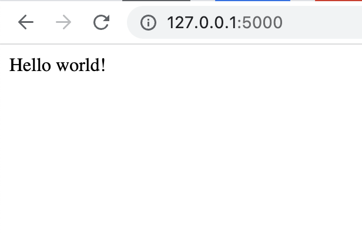
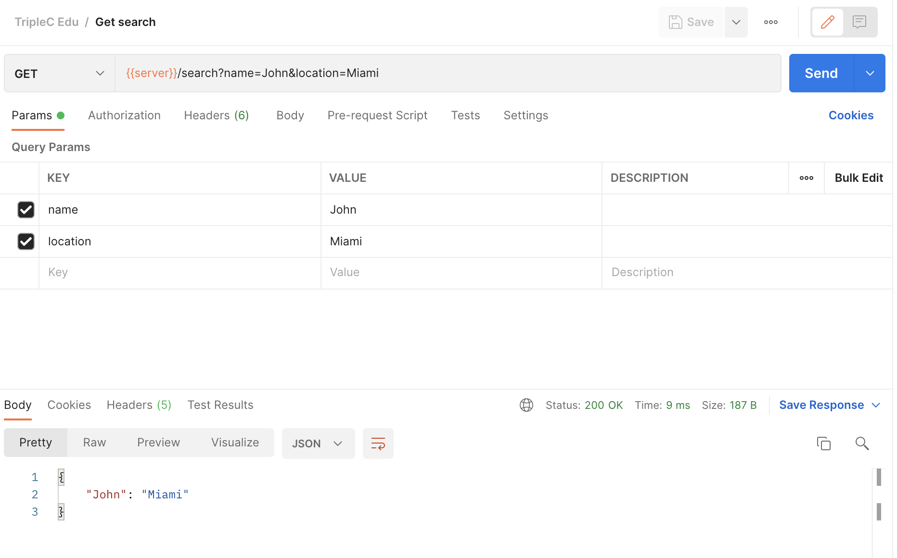
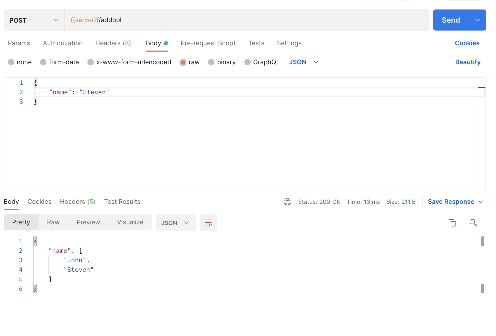
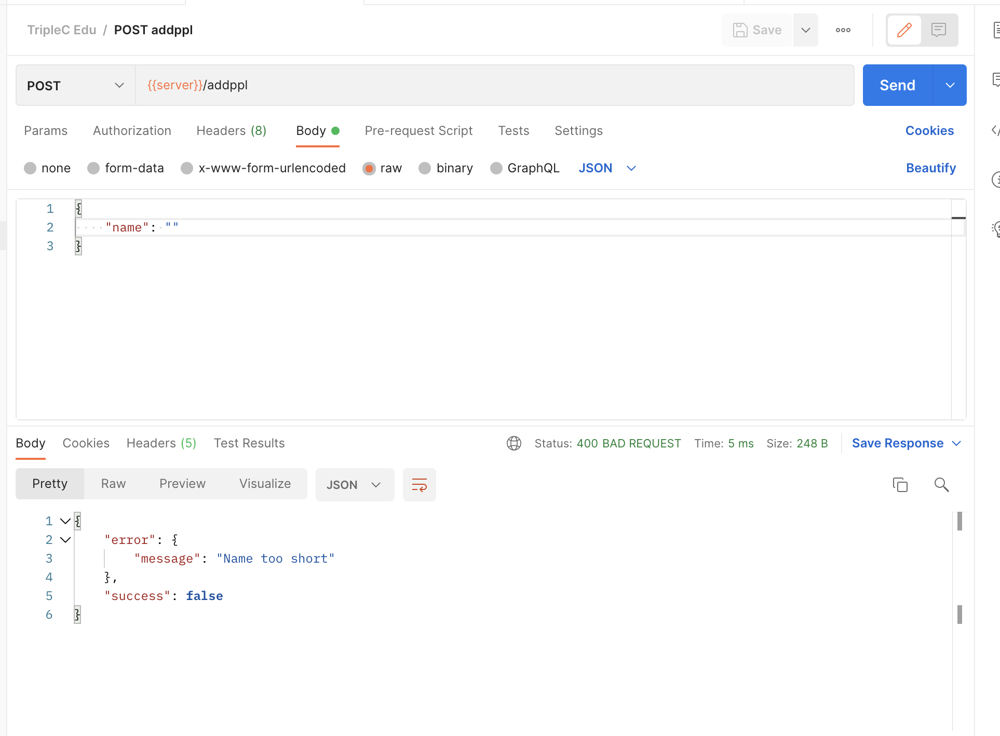

# Flask

[Official Doc](https://flask.palletsprojects.com/en/2.1.x/)

## Table of Content
### 1. [Intro](#intro)
### 2. [Set up](#set-up)
### 3. [Client Server architecture](#client-server-architecture)
* [Restful API](#restful-api)
### 4. [HTTP](#http)
* [HTTP Request Type](#http-request-type)
* [HTTP response status codes](#http-response-status-codes)
### 5. [Syntax](#syntax)

## Intro
Flask is a web framework, it’s a Python module that lets you develop web applications easily. It’s has a small and easy-to-extend core: it’s a microframework that doesn’t include an ORM (Object Relational Manager) or such features.

Even though Flask has a strong support toward web development such as template engine. We will not use it here since we already know React, a much more powerful tool. The reason we use Flask over other framework is because of its simplicity of its syntax. In this educational program, we will use Flask as a pure ***Restful API***

## Set up

To install Flask, simply do
```
pip3 install flask
```

OR 

there's a more advanced way of setting it up, first install virtualenv
```
pip3 install virtualenv
```
This is used for creating lightweight “virtual environments” to avoid problems with conflicting libraries which happens a lot in Python. To create the virtual environment, do the following command in your working directory
```
virtualenv env
```
To activate the environment, do
```
source env/bin/activate
```
Now you should see ```(env)``` at the front of your terminal command line. After that anything that we do will be contained inside of that virtual environment. Now insall flask inside the vm
```
pip3 install flask
```

For the debuging and testing purposes, it's highly recommended to download [Postman](https://www.postman.com/) in [here](https://www.postman.com/downloads/). It's a tool that you can directly fire request to your api without actually building a frontend interface.

Before we actually dive in flask, we need to first introduce some concept about software development.


## Client Server architecture
The following graph explains the architecture


It's a modern architecture that isolate frontend and backend, so each developers can only focus on their task and eventually use ***Restful API*** to connect them, and this is the architecture that is commonly applied in most of the TripleC project.

### Restful API
An API, or application programming interface, is a set of rules that define how applications or devices can connect to and communicate with each other. A REST API is an API that conforms to the design principles of the REST, or representational state transfer architectural style. For this reason, REST APIs are sometimes referred to RESTful APIs.

In shorts, there are four main operation in Restful API, Create, Read, Update and Delete. We call it ***CRUD*** for convenience.

## HTTP
The Hypertext Transfer Protocol (HTTP) is designed to enable communications between clients and servers, and it works as a request-response protocol between a client and server.

For the full HTTP content, refer the doc [here](https://developer.mozilla.org/en-US/docs/Web/HTTP)

### HTTP Method
There are some commonly used methods to enable HTTP communication
| Method      | Description |
| :---        |    :----:   |  
| GET     | The GET method is used to retrieve information from the given server using a given URI. Requests using GET should only retrieve data and should have no other effect on the data. | 
| POST  | A POST request is used to send data to the server, for example, customer information, file upload, etc. using HTML forms. | 
| PUT    | Replaces all current representations of the target resource with the uploaded content. | 
| DELETE  | Removes all current representations of the target resource given by a URI.  |
| PATCH  | The PATCH method is used to apply partial modifications to a resource. |

Among them, ```GET``` and ```POST``` are the two most common methods. Here are some difference

GET
* GET requests can be cached
* GET requests remain in the browser history
* GET requests can be bookmarked
* GET requests should never be used when dealing with sensitive data
* GET requests have length restrictions
* GET requests are only used to request data (not modify)

POST
* POST requests are never cached
* POST requests do not remain in the browser history
* POST requests cannot be bookmarked
* POST requests have no restrictions on data length

The implementation varies depends on the language and framework. However the main idea is when using ```GET``` request, the ```params``` is embedded inside the url such as ```http://www.mysite.com/mypage.html?var1=value1&var2=value2&var3=value3``` whereas ```POST``` requests embedded those params inside the ```payload```

In ***Rest API***, CRUD is ```POST```, ```GET```, ```PUT```, ```DELETE``` respectively.


### HTTP response status codes
Status code indicites the status of the respective HTTP request and indicate whather it is received successfully and gives proper information to the developer

Here are some status code that is commonly seen
| Code    | Meaning | Description |
| :---    | :------:    |    :----:   |  
| 100  | Continue | Everything so far is OK and that the client should continue with the request or ignore it if it is already finished. | 
| 200  | OK |  The request has succeeded. A 200 response is cacheable by default. | 
| 201 |Created  |The request has succeeded and has led to the creation of a resource. | 
| 204  | No Content  | A request has succeeded, but that the client doesn't need to navigate away from its current page | 
| 304 | Not Modified  | There is no need to retransmit the requested resources. |
| 400 | Bad Request  | The server cannot or will not process the request due to something that is perceived to be a client error |
| 400 | Bad Request  | The server cannot or will not process the request due to something that is perceived to be a client error |
| 401 | Unauthorized | The client request has not been completed because it lacks valid authentication credentials for the requested resource |
| 403 | Forbidden | The server understands the request but refuses to authorize it. |
| 404 | Not Found | The server cannot find the requested resource. |
| 405 | Method Not Allowed | The server knows the request method, but the target resource doesn't support this method. |
| 409 | Conflict | A request conflict with the current state of the target resource. |
| 410 | Gone | Access to the target resource is no longer available at the origin server and that this condition is likely to be permanent.|
| 500 | Internal Server Error | The server encountered an unexpected condition that prevented it from fulfilling the request.|
| 501 | Not Implemented | The server does not support the functionality required to fulfill the request.|
| 502 | Bad Gateway | The server, while acting as a gateway or proxy, received an invalid response from the upstream server.|
| 503 | Service Unavailable | The server is not ready to handle the request.|

Typically, ```1..``` means informational response, ```2...``` means success, ```3..``` means redirection, ```4..``` means client errors, ```5..``` means server errors.

### Syntax
To create a very simple flask application simply do
```python
from flask import Flask

# Init the flask app
app = Flask(__name__) 

# hello_world() is called when we access the '/' which is the root url
@app.route('/')
def hello_world():
    return 'Hello world!'

# This file got executed when ran directly
if __name__ == "__main__":
    app.run(debug=True)
```

To activate it, do
```
python3 app.py
```

You should see something like this
```
 * Serving Flask app 'app' (lazy loading)
 * Environment: production
   WARNING: This is a development server. Do not use it in a production deployment.
   Use a production WSGI server instead.
 * Debug mode: on
 * Running on http://127.0.0.1:5000 (Press CTRL+C to quit)
 * Restarting with stat
 * Debugger is active!
 * Debugger PIN: 383-983-382
```
One thing to notice is that ```Running on http://127.0.0.1:5000 (Press CTRL+C to quit)```. When we go to ```http://127.0.0.1:5000```, you should see the following.



This is the flask hello world example, but it's not an api yet. Now we need to enable the HTTP method in flask.

The implementation is easy, in ```@app.route``` tag, there is another argument called ```methods``` which takes an array of HTTP methods.
```python
from flask import Flask
app = Flask(__name__)

@app.route('/', methods=['GET', 'POST'])
def hello_world():
    return 'Hello world!'

if __name__ == "__main__":
    app.run(debug=True)
```

This means you can only access ```/``` (```http://127.0.0.1:5000/```) with GET or POST request otherwise you will get a ```405``` error code.

On the other hand, if you want to send argument to the backend server, you can do
```python
from flask import Flask
app = Flask(__name__)

@app.route('/', methods=['GET', 'POST'])
def hello_world():
    return 'Hello World!'

@app.route('/items/<int:id>', methods=['GET'])
def get_item(id):
    arr = [1,2,3,4,5,6]
    # The return type must be a string, dict, tuple
    return str(arr[id])

if __name__ == "__main__":
    app.run(debug=True)
```

Therefore it will return ```2``` when you fire a GET request to ```http://127.0.0.1:5000/items/1```

You can also distinguish the type of methods using ```request.method```
```python
# Notice I import request from flask
from flask import Flask, request 
app = Flask(__name__)

@app.route('/', methods=['GET', 'POST'])
def hello_world():
    if request.method == 'POST':
        return "It's a POST request"
    else:
        return "It's a GET request"

@app.route('/items/<int:id>', methods=['GET'])
def get_item(id):
    arr = [1,2,3,4,5,6]
    return str(arr[id])

if __name__ == "__main__":
    app.run(debug=True)
```

However that's not the only way to get ```params``` from ```GET``` request, we can also do the following
```python
from flask import Flask, request 
app = Flask(__name__)

db_users = {
    "John" : "Miami",
    "David" : "Miami",
    "Jane" : "London",
    "Gabriella" : "Paris",
    "Tanaka" : "Tokyo"
}

items = [1,2,3,4,5,6]

@app.route('/', methods=['GET', 'POST'])
def hello_world():
    if request.method == 'POST':
        return "It's a POST request"
    else:
        return "It's a GET request"

@app.route('/items/<int:id>', methods=['GET'])
def get_item(id):
    return str(items[id])

@app.route('/search', methods=['GET'])
def search():
    args = request.args
    name = args.get('name')
    location = args.get('location')

    # result = db_users
    if None not in (name, location):
        result = {key: value for key, value in db_users.items() if key == name and value == location}
    elif name is not None:
        result = {key: value for key, value in db_users.items() if key == name}
    elif location is not None:
        result = {key: value for key, value in db_users.items() if value == location}

    return result

if __name__ == "__main__":
    app.run(debug=True)
```

To access ```\search```, do ```http://127.0.0.1:5000/search?name=NAME&location=LOCATION```. For example ```http://127.0.0.1:5000/search?name=John&location=Miami```

On Postman, the request looks like the following


Usually when sending the response back to the client, we want to convert it in ```JSON``` format.
```python
# Note I import jsonify
from flask import Flask, request, jsonify 
app = Flask(__name__)

db_users = {
    "John" : "Miami",
    "David" : "Miami",
    "Jane" : "London",
    "Gabriella" : "Paris",
    "Tanaka" : "Tokyo"
}

items = [1,2,3,4,5,6]

@app.route('/', methods=['GET', 'POST'])
def hello_world():
    if request.method == 'POST':
        return jsonify({'message': "It's a POST request"})
    else:
        return jsonify({'message': "It's a GET request"})

@app.route('/items/<int:id>', methods=['GET'])
def get_item(id):
    item = str(items[id])
    return jsonify({'item': item})

@app.route('/search', methods=['GET'])
def search():
    args = request.args
    name = args.get('name')
    location = args.get('location')

    # result = db_users
    if None not in (name, location):
        result = jsonify({key: value for key, value in db_users.items() if key == name and value == location})
    elif name is not None:
        result = jsonify({key: value for key, value in db_users.items() if key == name})
    elif location is not None:
        result = jsonify({key: value for key, value in db_users.items() if value == location})

    return result

if __name__ == "__main__":
    app.run(debug=True)
```

Now the response will be like ```{ "item": 2 }``` for ```http://127.0.0.1:5000/items/1```

Another way to send data from client to server is to pass the data into payload. To retrive that from the server, we can do
```python
from flask import Flask, request, jsonify, abort

app = Flask(__name__)

db_users = {
    "John" : "Miami",
    "David" : "Miami",
    "Jane" : "London",
    "Gabriella" : "Paris",
    "Tanaka" : "Tokyo"
}

users = {
    "name": ["John"]
}

items = [1,2,3,4,5,6]

@app.route('/', methods=['GET', 'POST'])
def hello_world():
    print(request)
    if request.method == 'POST':
        return jsonify({'message': "It's a POST request!"})
    else:
        return jsonify({'message': "It's a GET request"})

@app.route('/items/<int:id>', methods=['GET'])
def get_item(id):
    item = str(items[id])
    return jsonify({'item': item})

@app.route('/search', methods=['GET'])
def search():
    args = request.args
    name = args.get('name')
    location = args.get('location')

    # result = db_users
    if None not in (name, location):
        result = jsonify({key: value for key, value in db_users.items() if key == name and value == location})
    elif name is not None:
        result = jsonify({key: value for key, value in db_users.items() if key == name})
    elif location is not None:
        result = jsonify({key: value for key, value in db_users.items() if value == location})

    return result

@app.route('/addppl', methods=['POST'])
def addppl(): 
    data = request.json

    # Error handle
    if len(data['name']) < 1:
        status_code = 400
        success = False
        response = {
            'success': success,
            'error': {
                'message': "Name too short"
            }
        }
        return jsonify(response), status_code

    users["name"].append(data['name'])
    return users

if __name__ == "__main__":
    app.run(debug=True)
```

Notice I used did error handle with the customize error message and appreciate status code

Therefore on Postman if you want to make the request, you can do


If there's an error, the response will look like this


Finally before deploying the app, run
```
pip3 freeze > requirement.txt
```
So it will put all versions inside the ```requirement.txt``` file. Next time if you clone other developer's python repo with ```requirement.txt```, you can install the required dependencies with ```pip install -r requirements.txt```