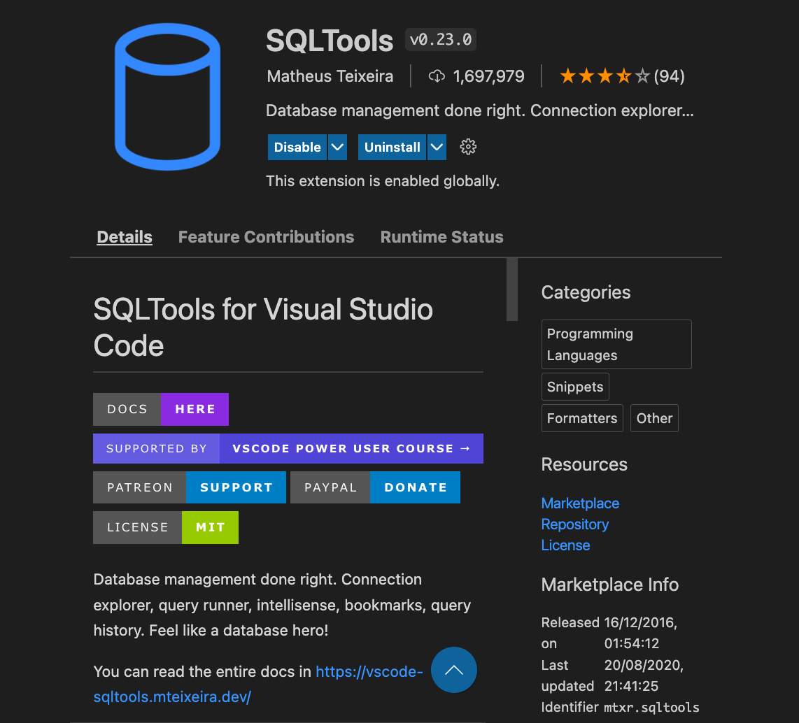
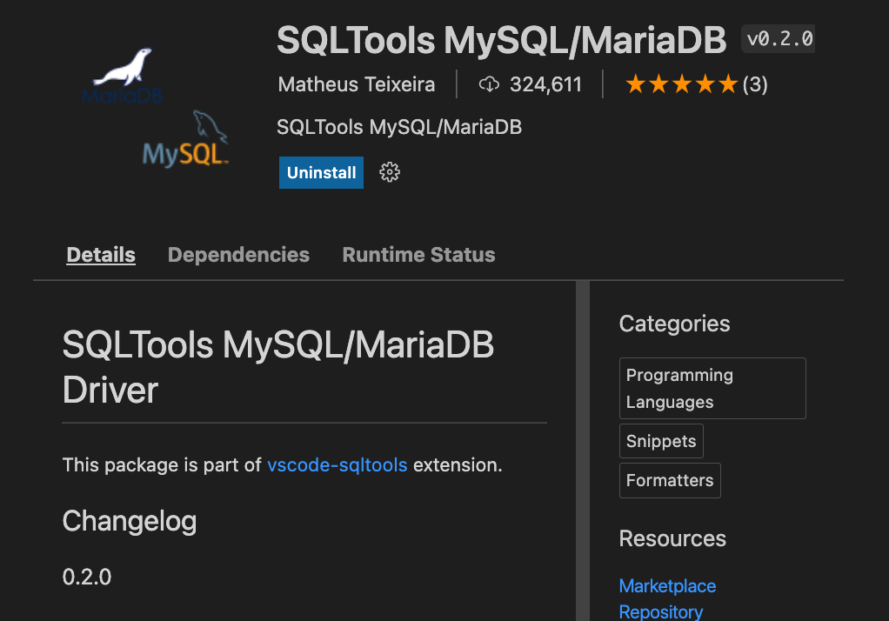
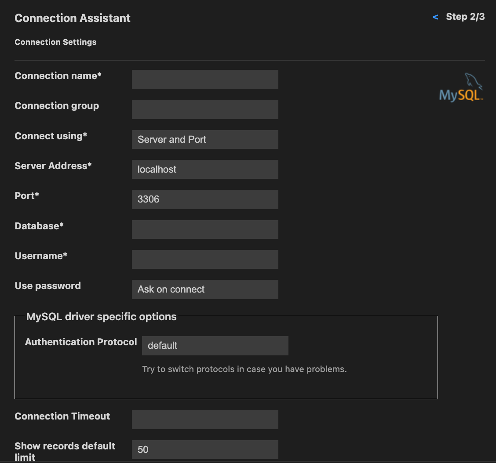
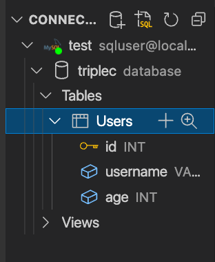
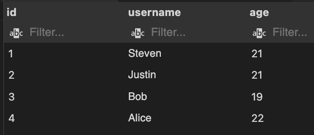

# SQL

[Official Doc (MySQL)](https://www.mysql.com/)

## Table of Content
### 1. [Intro](#intro)
### 2. [Relational Database and No Relational Database](#relational-database-and-no-relational-database)
### 3. [ACID](#acid)
### 4. [Set up](#set-up)
### 5. [Vocab](#vocab)
### 6. [Syntax](#syntax)
* [CREATE](#create)
* [INSERT](#insert)
* [SELECT](#select)
* [UPDATE](#update)
* [INDEX](#index)
* [JOIN](#join)

## Intro

SQL (structured query language) is a querying language used for managing data held in a relational database. Among all those SQL languages, MySQL is the most famous and the most commonly used ones. Therefore in this case we will be using MySQL to learn SQL

## Relational Database and No Relational Database
In short, relational databases (SQL databases or Relational Database Management System(RDBMS)) store data in rows and columns like a spreadsheet while non-relational databases (NoSQL database) uses a storage model optimized for specific requirements of the type of data being stored. There are four popular non-relational types: document data store, column-oriented database, key-value store and graph database.  Often combinations of these types are used for a single application.

* SQL databases
  * They work with structured data.

  * Relationships in the system have constraints, which promotes a high level of data integrity.

  * There are limitless indexing capabilities, which results in faster query response times.

  * They are excellent at keeping data transactions secure.

  * They provide the ability to write complex SQL queries for data analysis and reporting.

  * Their models can ensure and enforce business rules at the data layer adding a level of data integrity not found in a non-relational database.

  * They are table and row oriented.

  * They Use SQL (structured query language) for shaping and manipulating data, which is very powerful.

  * SQL database examples: MySql, Oracle, Sqlite, Postgres and MS-SQL. NoSQL database examples: MongoDB, BigTable, Redis, RavenDb, Cassandra, Hbase, Neo4j and CouchDb.

  * SQL databases are best fit for heavy duty transactional type applications.
  * Can be scaled vertically, by increasing the processing power of existing hardware
  * Follows ***ACID*** properties (Atomicity, Consistency, Isolation, Durability)
  
* NoSQL databases
  * They have the ability to store large amounts of data with little structure.

  * They provide scalability and flexibility to meet changing business requirements.

  * They provide schema-free or schema-on-read options.

  * They have the ability to capture all types of data “Big Data” including unstructured data.

  * They are document oriented.

  * NoSQL or non-relational databases examples:MongoDB, Apache Cassandra, Redis, Couchbase and Apache HBase.

  * They are best for Rapid Application Development. NoSQL is the best selection for flexible data storage with little to no structure limitations.

  * They provide flexible data model with the ability to easily store and combine data of any structure without the need to modify a schema.
  * Can be scaled horizontally by using a master-slave architecture with additional servers or nodes
  * Follows ***CAP*** properties (Consistency, Availability, Partition tolerance)

## ACID
***Atomicity*** means all transactions must succeed or fail completely. They cannot be partially-complete, even in the case of system failure.

***Consistency*** means that at each step the database follows invariants: rules which validate and prevent corruption.

***Isolation*** prevents concurrent transactions from affecting each other. Transactions must result in the same final state as if they were run sequentially, even if they were run in parallel.

***Durability*** makes transactions final. Even system failure cannot roll-back the effects of a successful transaction.

## Set up
Install MySQl [here](https://dev.mysql.com/downloads/mysql/). It will ask you to choose a password and make sure you remember them! (The default username is ***root***)

Now install SQLTools from VScode Extensions, this enable SQL support on the VScode text editor



And then install ***SQLTools MySQL/MariaDB***. This is the driver for SQLTools



## Vocab
Before we start to learn the syntax, there are some vocabs you need to know. The data is usually stored in ***Table*** which looks like a Excel spread sheets. A ***Table*** has ***Columns*** and ***Rows***, a ***Column*** contains data of one and the same kind, for example, the column age while a ***Row*** is a group of related data, for example, the data of one user. Therefore a Database is actually the collection of ***Tables***. 

Each ***Tables*** has different relationships towards other ***Tables*** for example ***one-to-one***, ***one-to-many***, ***many-to-many***, ***many-to-one***. The blueprint that defines different rules or constraints to the database is called ***Schema***. In addition there are many datatypes that can be stored inside a table such as: ***Int***, ***Float***, ***Varchar*** (Short string), ***Text*** (Longer string) etc.

Here's an example:


This is a table about each staff which contain four pieces of information (id, first name, last name, department name), so a column is a pieces of information such as ```first_name```, and each row is like a dataset (one staff's full information). When we are creating the table everytime, we need to make sure we have a ***Primary Key*** column, in this case is the ```id``` column. A ***Primary Key*** cannot be ```null``` and has to be unique, this ensures each row in the table can be identified, and this will become important when building relationship with other tables

## Syntax

To start, on the terminal type ```mysql -u root -p``` and type in your password, you will see the prompt becomes ```mysql>``` then you can create a database called ```triplec``` by doing
 ```
 CREATE DATABASE triplec;
 ``` 
 You should see ```Query OK, 1 row affected (0.01 sec)```. To quit from the prompt, simply type
 ```
 quit
 ```

Now, click on the database icon on the left side panel of the vscode and then select MySQL, you should see the following:



Now fillin the ```Connection name```. ```Database name``` and your username (root) and password. It should look like this


After that click ```Save Connection``` and click ```Connect Now```, you will see a ```test.session.sql``` file generated in your working directory.

### Create

First of all, to create a table, do
```sql
--@block
CREATE TABLE Users(
    id INT PRIMARY KEY AUTO_INCREMENT, 
    username VARCHAR(255) NOT NULL UNIQUE,
    age INT 
 );
```
Notice ```CREATE TABLE``` is not case sensitive, ```create table``` also works, and ```Users``` is the name of this table with three fields: ```id``` with type ```INT```, ```username``` with type ```VARCHAR``` and maximum length of 255, ```UNIQUE``` means the ```username``` should not contain duplicate value. ```age``` with type ```INT```. ```id``` also has ```PRIMARY KEY``` constraint which means it's unique and cannot be null. ```AUTO_INCREMENT``` keyword in ```id``` means it will auto increase the value when new entry being added. After you run this commnand, you should see the following on your SQLtool panel:



***Common Error***

If you have auth error when doing this step, try the following command in the mysql prompt
```
CREATE USER 'sqluser'@'%' IDENTIFIED WITH mysql_native_password BY 'password';
```
```
GRANT ALL PRIVILEGES ON *.* TO 'sqluser'@'%';
```
```
FLUSH PRIVILEGES;
```
Then disconnect the SQLtool and change your username to ```sqluser``` and password to ```password``` and connect your connections again.

### Insert

After we have a table, to insert data, we can use the ```INSERT``` statement:
```sql
--@block
INSERT INTO Users(username, age)
VALUES("Steven", 21);
```
Notice the order of ```username``` and ```age``` matters since it corresponds to the value in ```VALUES```, and also notice I do not have ```id``` field because ```id``` has an ```AUTO_INCREMENT``` keyword that it will take cares of its value. Also you can insert multiple data at once by doing
```sql
--@block
INSERT INTO Users(username, age)
VALUES
    ("Justin", 21),
    ("Bob", 19),
    ("Alice", 22);
```

### Select

After we successfully insert the data, we cannot directly view them in the SQLtool panel. Instead we can use ```SELECT``` keyword to view them.

If you want to see everything from the ```User``` table, you can do
```sql
--@block
SELECT * FROM Users;
```
Then you should see something like this:



However, you can do more powerful query such as
```sql
--@block
SELECT username, age FROM Users ORDER BY age DESC LIMIT 3;
```
This means to select only the ```username``` and ```age``` field from ```Users``` table that is ordered by age in descending order and show the top 3 user.

```sql
--@block
SELECT username FROM Users WHERE age >= 21;
```
This means to select the ```username``` field from ```Users``` table for the user who is an adult (greater or equal to 21 yrs old)

```sql
--@block
SELECT username FROM Users WHERE age >= 21 AND username LIKE 's%';
```
This means to select the ```username``` field from ```Users``` table for the user who is an adult (greater or equal to 21 yrs old) and his name contains the character 's'

### Update

 To update the data, you can do
 ```sql
 --@block
UPDATE Users
SET age = 29
WHERE username LIKE 's%';
 ```
 This means select the user who's username contains 's' and set its age to 29. It can also do multiple updates at the same time such as

 ```sql
 --@block
UPDATE Users
SET age = 29, username = "Stephen"
WHERE username LIKE 's%';
 ```

### DELETE

```DELETE``` follows the same pattern, such as
```sql
DELETE FROM Users WHERE username == "Steven";
```
This is to delete user ```Steven``` from the ```Users``` table
```sql
DELETE FROM Users WHERE age < 21;
```
This is to delete all the users who's age is younger than 21

### Index

We have seen that ```SELECT``` is a very powerful command, but it will become very slow then the size of data scales dramatically. This is when ```INDEX``` comes into play

To create an index, simply do
```sql
CREATE INDEX username_index ON Users(username)
```
This will not have any immediate effect on our current database for now, but it will become much faster when you are querying the data based on ```username```.

## Tutorial (Optional)

[Tutorial](https://www.youtube.com/watch?v=HXV3zeQKqGY)
